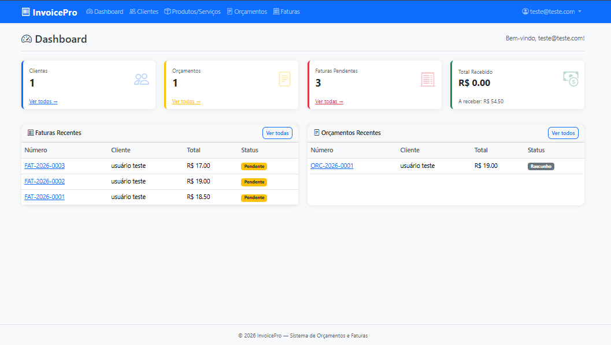
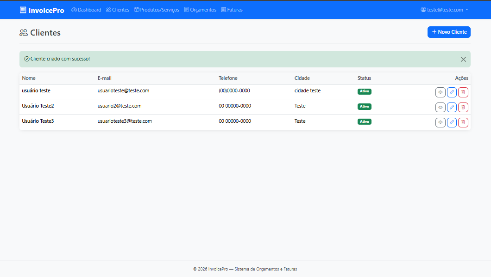
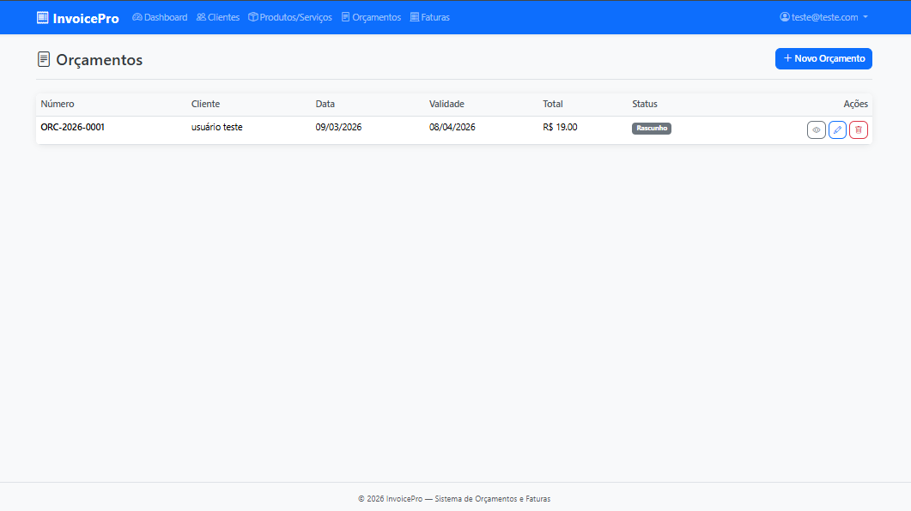
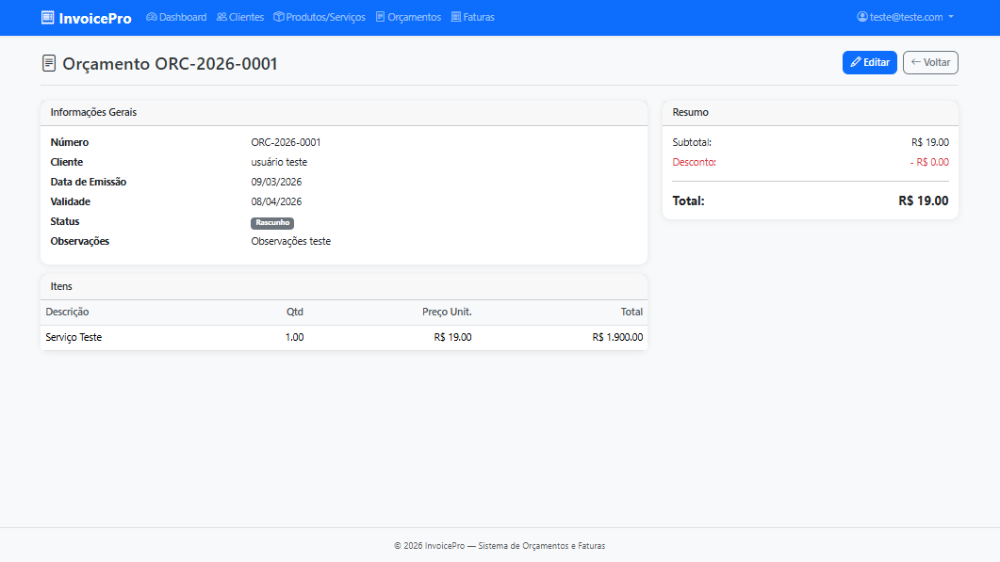
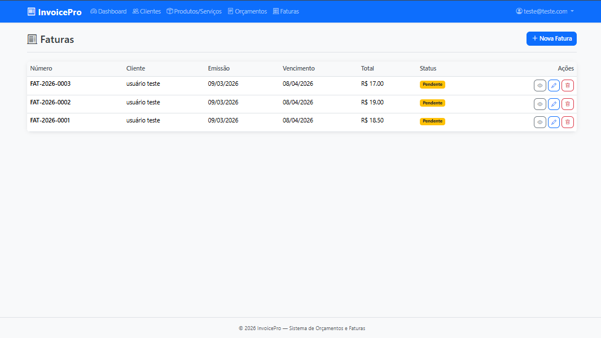
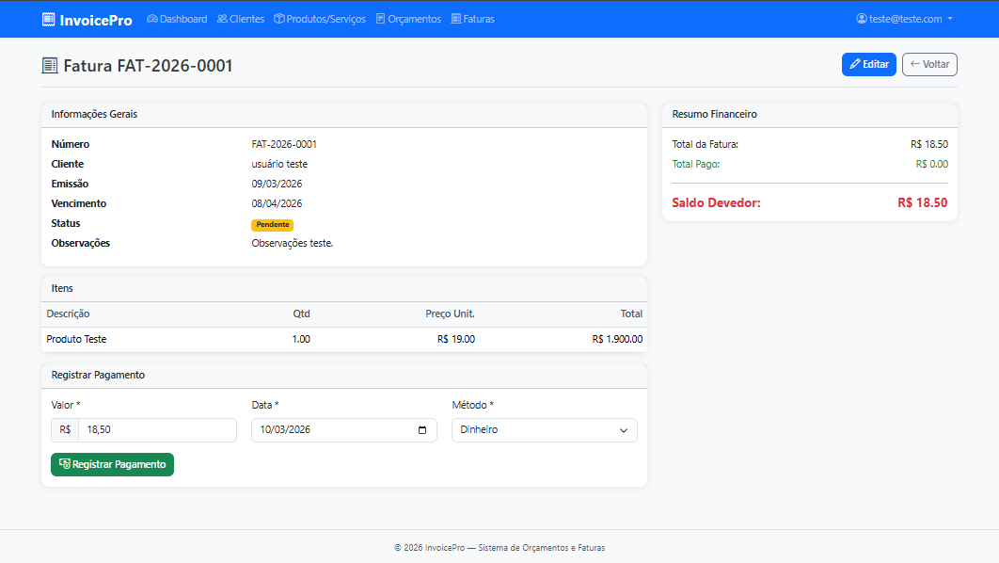

# 📄 InvoicePro

Sistema web de gerenciamento de orçamentos e faturas desenvolvido com **ASP.NET Core 8 MVC**.


---

## 🚀 Funcionalidades

- ✅ **Autenticação** — Cadastro e login com ASP.NET Core Identity
- ✅ **Dashboard** — Resumo financeiro com cards e atividade recente
- ✅ **Clientes** — CRUD completo com soft delete
- ✅ **Produtos e Serviços** — Catálogo com preços e unidades
- ✅ **Orçamentos** — Criação com itens dinâmicos e cálculo automático de totais
- ✅ **Faturas** — Emissão com controle de status e registro de pagamentos
- ✅ **Conversão** — Orçamento aprovado convertido em fatura com um clique
- ✅ **Multi-usuário** — Cada usuário vê apenas seus próprios dados

---

## 📸 Screenshots

### Dashboard


### Clientes


### Orçamentos


### Novo Orçamento


### Faturas


### Detalhes da Fatura


---


## 🏗️ Arquitetura

Projeto estruturado em **4 camadas** seguindo os princípios de separação de responsabilidades:
```
InvoicePro/
├── src/
│   ├── InvoicePro.Core/       # Interfaces, DTOs e Constants
│   ├── InvoicePro.Data/       # Models, DbContext e Migrations
│   ├── InvoicePro.Services/   # Implementações dos serviços e AutoMapper
│   └── InvoicePro.Web/        # Controllers, Views e Program.cs
```

**Padrão:** Controller → Service → Repository (via EF Core)

---

## 🛠️ Tecnologias

| Tecnologia | Uso |
|---|---|
| ASP.NET Core 8 MVC | Framework web |
| Entity Framework Core 8 | ORM e migrations |
| ASP.NET Core Identity | Autenticação e autorização |
| SQL Server LocalDB | Banco de dados |
| AutoMapper 12 | Mapeamento Entity ↔ DTO |
| Bootstrap 5 | Interface responsiva |
| Bootstrap Icons | Ícones |
| QuestPDF | Geração de PDF |
| MailKit | Envio de e-mails |
| FluentValidation | Validação de formulários |

---

## ⚙️ Como Rodar Localmente

### Pré-requisitos
- [.NET 8 SDK](https://dotnet.microsoft.com/download/dotnet/8.0)
- [SQL Server Express LocalDB](https://learn.microsoft.com/pt-br/sql/database-engine/configure-windows/sql-server-express-localdb)
- [Visual Studio 2022+](https://visualstudio.microsoft.com/) ou VS Code

### Passo a Passo
```bash
# 1. Clone o repositório
git clone https://github.com/degasdegani/InvoicePro.git
cd InvoicePro

# 2. Aplique as migrations
dotnet ef database update \
  --project src/InvoicePro.Data/InvoicePro.Data.csproj \
  --startup-project src/InvoicePro.Web/InvoicePro.Web.csproj

# 3. Rode a aplicação
dotnet run --project src/InvoicePro.Web/InvoicePro.Web.csproj
```

Acesse: `http://localhost:5227`

---

## 📁 Estrutura do Banco de Dados
```
AspNetUsers (Identity)
    ├── Clients
    │   ├── Budgets
    │   │   └── BudgetItems
    │   └── Invoices
    │       ├── InvoiceItems
    │       └── Payments
    └── ProductServices
```

---

## 👨‍💻 Autor

**Eduardo Degani**  
Desenvolvedor .NET em transição de carreira  
[](https://www.linkedin.com/in/eduardo-degani/)
[](https://github.com/degasdegani)